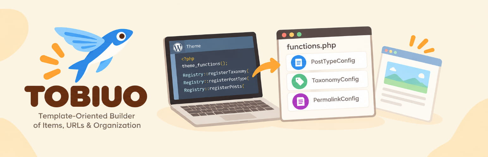

# TOBIUO

<!-- Banner placeholder: add .github/banner-1544x500.jpg (the WordPress.org banner) and reference it here, as TONKATSU's README does:

-->

Template-Oriented Builder of Items, URLs & Organization

## Description

This plugin registers a WordPress site's custom post types and taxonomies, and gives each post type its own permalink structure — `/case/%case_category%/%postname%/`, `/news/%year%/%monthnum%/%postname%/`, `/event/%post_id%/` — with optional date and author archives below the post type archive. All of it is configured in theme PHP code: nothing is stored in the database and there is no settings screen, so the content structure is version-controlled with the theme that displays it.

It replaces the [Custom Post Type Permalinks](https://wordpress.org/plugins/custom-post-type-permalinks/) plugin. It is a sibling of [TOFU](../template-oriented-form-utilities) and [TONKATSU](../tonkatsu-seo) and follows the same conventions.

## Installation

1. Upload the plugin files to the `/wp-content/plugins/tobiuo-content-structure` directory, or install the plugin through the WordPress plugins screen directly.
2. Activate the plugin through the 'Plugins' screen in WordPress.
3. Deactivate Custom Post Type Permalinks if it is active. While it is, TOBIUO registers the post types and taxonomies but leaves their URLs to it, and shows an admin notice.

## Usage

1. Register taxonomies and post types in your theme on `init`, in any order.
2. Give a post type a `PermalinkConfig` to choose its URL structure.
3. Open **Settings → Permalinks** after changing a structure, so WordPress regenerates the rewrite rules.

```php
add_action('init', function () {
    if (!class_exists('TobiuoPlugin\Helpers\Registry')) {
        return;
    }

    \TobiuoPlugin\Helpers\Registry::registerTaxonomy(new \TobiuoPlugin\Structure\TaxonomyConfig(
        name: 'case_category',
        objectTypes: ['case'],
        args: ['label' => '事例カテゴリー', 'hierarchical' => true, 'rewrite' => ['slug' => 'case-category', 'with_front' => false]],
    ));

    \TobiuoPlugin\Helpers\Registry::registerPostType(new \TobiuoPlugin\Structure\PostTypeConfig(
        name: 'case',
        args: ['label' => '事例紹介', 'public' => true, 'has_archive' => true, 'rewrite' => ['slug' => 'case', 'with_front' => false]],
        permalink: new \TobiuoPlugin\Structure\PermalinkConfig(
            structure: '/%case_category%/%postname%/',
            dateArchive: true,
        ),
    ));
});
// https://example.com/case/consulting/strategy/my-case/
// https://example.com/case/2024/05/
```

[Detailed Documentation](docs/index.md)
